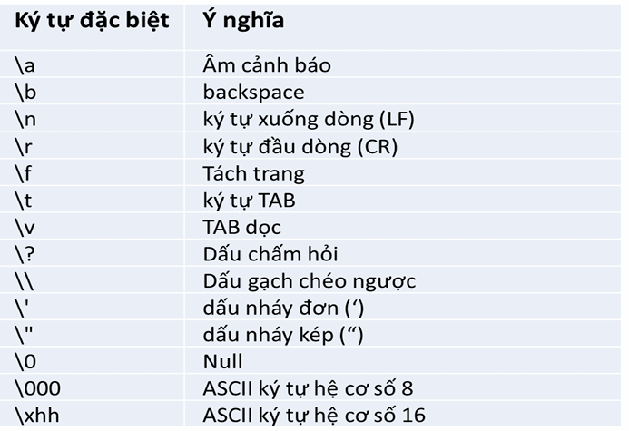

<section>
  <!-- HEADER -->
  <div class="title-header">
    
  </div>

  <!-- CENTER -->
  <div class="title-center">
    <h1>Thực hành buổi 1</h1>
    <h3>Giảng viên: Ths.Lâm Du Đạt</h3>
    <p>Email: datld@donga.edu.vn</p>
  </div>

  <!-- FOOTER -->
  <div class="title-footer">
    <p>Trường Đại học Đông Á : Khoa Điện – Điện tử</p>
  </div>
  
</section>

---

## Cấu trúc chương trình C
<div class="content">

```c step
//khai báo thư viện
#include <stdio.h>
//khai báo hàm chính
int main() 
{
    //gọi hàm con
    printf("hello world") 
    
    //khai báo khối lặp
    while(1) 
    {
        //code trong vòng lặp
    }
}
```

</div>

---

## Cấu trúc chương trình Arduino
<div class="content">

[Công cụ mô phỏng online TinkerCard](https://www.tinkercad.com)

```Arduino step
//khai báo hàm setup()
void setup()
{
    Serial.begin(9600)
    Serial.println("hello world)
}

//khai báo hàm loop
void loop()
{
    //code vòng lặp
}
```

</div>

---

## Hàm `printf()` trong C
<div class="content">

<mark>`int printf(const char * format, ...)`</mark>

```c
printf("Ten=Hoa, tuoi=18");
```

```c
printf("Ten=%s, tuoi=%d","Hoa",18);
```

</div>

---

## Thẻ định dạng trong C

<div class="content">

<mark>%[flags][width][.precision][length]specifier</mark>


</div>

---

## Chuỗi thoát trong C

<div class="content">



</div>

---

## [C] Bài tập 1

<div class="content">

Viết chương trình in ra màn hình thông tin sau (Sử dụng `printf` và thẻ định dạng cho các giá trị)
- Nhiet do : 30
- Do am : 95.5
- Quat : Tat
- Trang thai: "Binh thuong"


</div>

---

## [Arduino] Bài tập 2

<div class="content">

Trong Arduino, viết chương trình in ra màn hình thông tin sau (sử dụng `Serial.println()`)
- Nhiet do : 20
- Do am : 80
- Quat : Bat
- Trạng thai: Nhiet do cao

</div>

---