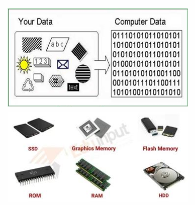
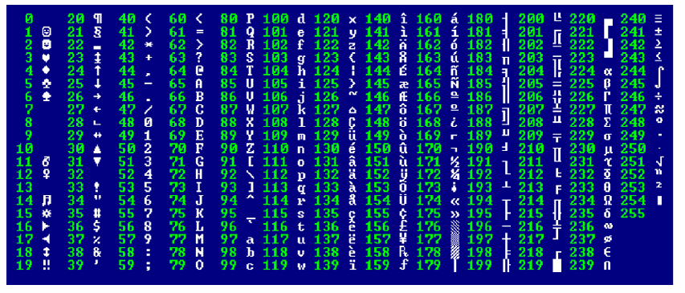
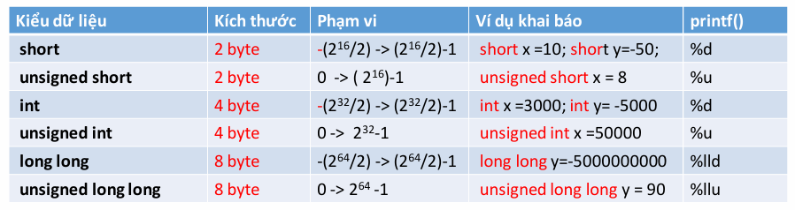
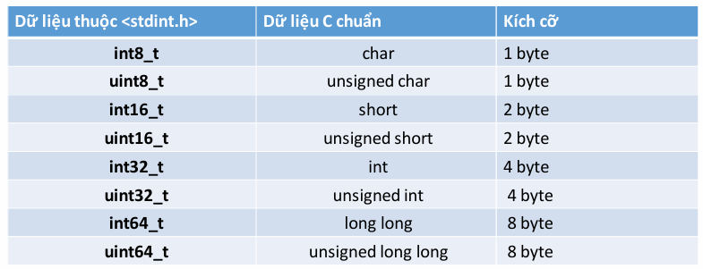
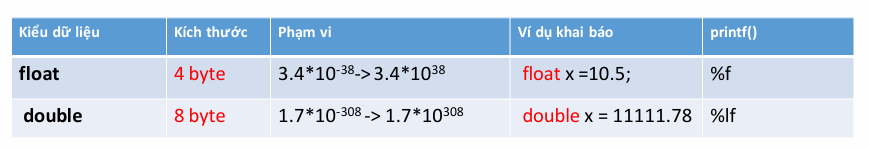
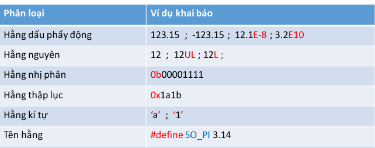
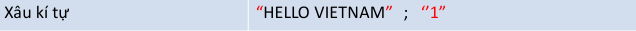
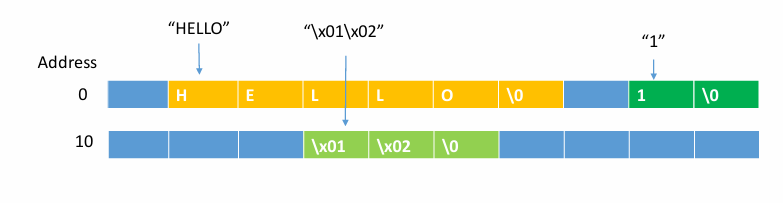
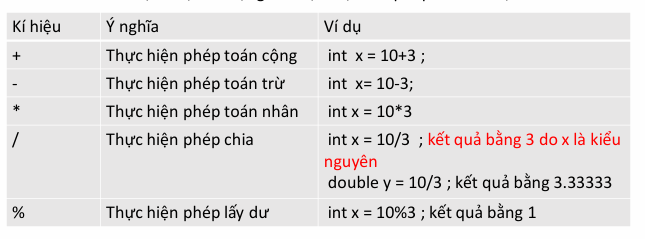

<section>
  <!-- HEADER -->
  <div class="title-header">
    
  </div>

  <!-- CENTER -->
  <div class="title-center">
    <h1>Thực hành buổi 2</h1>
    <h3>Giảng viên: Ths.Lâm Du Đạt</h3>
    <p>Email: datld@donga.edu.vn</p>
  </div>

  <!-- FOOTER -->
  <div class="title-footer">
    <p>Trường Đại học Đông Á : Khoa Điện – Điện tử</p>
  </div>
  
</section>

---

# I. Các kiểu dữ liệu cơ bản
<div class="content split-2">

<div>

- Kiểu kí tự
- Kiểu số nguyên
- Kiểu số thực
- Kiểu hằng
- Kiểu chuỗi

<p>

<mark>**Công thức lấy kích thước dữ liệu**</mark><br>
<mark>`sizeof(kiểu dữ liệu)` </mark>

</p>


<p>

<mark>**Công thức lưu dữ liệu vào bộ nhớ**</mark><br>
<mark>`kiểu_dữ_liệu tên_biến = giá_trị`</mark>

</p>

</div>

<div>



</div>

</div>

---

## 1. Kiểu kí tự

<div class="content">


</div>

---

### Mã ascii

<div class="content">



</div>

---

## 2. Kiểu số nguyên

<div class="content">



</div>

---

### Kiểu số nguyên được chuẩn hóa

<div class="content">

<mark>Thư viện `<stdint.h>` </mark>



</div>

---

## 3. Kiểu số thực

<div class="content">



</div>


---

## 4. Kiểu hằng

<div class="content">



</div>

---

## 5. Kiểu chuỗi

<div class="content">



<mark> Bản chất kiểu xâu kí tự là một mảng kiểu kí tự (char) và kết thúc là ký tự null (\0) </mark>

- Bộ nhớ lưu chuỗi:



</div>

---

## Bài tập 1
<div  class="content">

Cho biết kiểu dữ liệu phù hợp với các tình huống sau
- Dữ liệu nhiệt độ 
- Dữ liệu độ ẩm 
- Dữ liệu trạng thái nút nhấn 
- Dữ liệu trạng thái hệ thống
- Dữ liệu góc quay động cơ
- Dữ liệu điểm sinh viên
- Dữ liệu tên cảm biến
- Dữ liệu điện áp
- Số 11111
- Số 111111111111
- Số 111.1111
- Số 111111111111.1111

</div>

---

# II. Biến

<div class="content">

- Biến là tên người lập trình đặt để đại diện cho vùng nhớ
- Dựa vào biến ta biết được thông tin sau
  - Địa chỉ bắt đầu của vùng nhớ
  - kích thước vùng nhớ
  - giá trị lưu trong vùng nhớ
- **Quy tắc đặt tên biến**
  - <mark>Chứa các kí tự nằm trong tập kí tự C hỗ trợ</mark>
  - không được bắt đầu bằng số
  - không chứa khoảng trắng
  - không được chứa các toán tử 
  - không chứa các kí hiệu đặc biệt
  - không trùng với tên từ khoá, tên hằng

</div>

---

## Khởi tạo biến

<div class="content">

<mark> **kiểu_dữ_liệu**  tên_biến = **giá_trị_khởi_tạo** </mark> <br>

### Bài tập 2:
- Tạo biến  `nhiet_do` để lưu giá trị nhiệt độ 35.5 độ
- Tạo biến  `do_am`  để lưu  giá trị độ ẩm  90.5%
- Tạo biến  `trang_thai_nut_nhan`  để lưu giá trị 0 hoặc 1
- Tạo biến `trang_thai_he_thong`  để lưu giá trị "tot", "canh bao" , "loi" ...
- Tạo biên `ten_cam_bien`  để lưu giá giá trị "cam bien nhiet phong 1"
- <mark>Xuất tất cả thông tin các biến ra màn hình</mark>

### Bài tập 3:
- Thực hiện tất cả nhiệm vụ trên  cho board arduino

</div>

---

## Đọc địa chỉ của biến: Toán từ `&`

<div class="content">

- Lấy địa chỉ của biến thông qua toán tử &
- Để lưu địa chỉ ta dùng con trỏ:  <mark> kieu_du_lieu * ten_con_tro </mark>
- Thông qua con trỏ ta có thể lấy lại giá trị của ô nhớ 

```c

int x  = 18;
//tạo con trỏ để lưu địa chỉ của biến x
int* p_x = &x;  //con trỏ đã lưu địa chỉ của biến x
//in con giá trị con trỏ
printf("gia tri p_x=%p",p_x);
//dùng con trỏ lấy lại giá trị ô nhớ
int y= *p_x;
//in giá trị của y
printf("gia tri x=%d\n",y);

```

</div>

---

## Khởi tạo biến hằng: từ khóa `const`

<div class="content">

- Khi ta muốn một biến được gán cố định và không cho phép thay đổi trong suốt chương trình ta dùng biến hắng
- Cú pháp:  <mark>  **const** kiểu_dữ_liệu  <span style="color:red; font-weight:bold">tên_biến</span>  =  giá_trị_khởi_tạo </mark>

```c

const double pi = 3.1415;
const pin_lcd_d1=3;

```

- Khi cố tình sửa đổi biến hằng sẽ báo lỗi: 

```c

pin_lcs_d1=5   //sẽ báo lỗi 

```

</div>

---

## Phạm vi hoạt động của biến
### Biến toàn cục

<div class ="content">

- Ta muốn một biến có thể sử dụng mọi nơi trong chương trình
- Khai báo biến nằm ngoài tất cả các hàm
- Chỉ sử dụng biến toàn cục khi cần thiết, nếu lạm dụng sẽ mau hết bộ nhớ

```c

#include <stdio.h>
int x =8;  //biến toàn cục
int main()
{
  {
    printf("x=%d",x); //biến x sử dụng trong khối lệnh
  }
  //Tới đây biến x vẫn có thể sử dụng tiếp
}

```

</div>

---

### Biến cục bộ

<div class ="content">

- Biến được giải phóng khi thực thi một khối lệnh
- Nên ưu tiên biến cục bộ vì nó tiết kiệm ram

```c

#include <stdio.h>
int main()
{
  {
    int x =8; //khai biến cục bộ
    printf("x=%d",x);
  }
  //tới đây biến x đã được giải phóng
}

```

</div>

---

# III. Toán tử số học

<div class ="content">



</div>

---

## Ép kiểu trong C

<div class ="content">

- Ép kiểu tự động: 
  - Khi thực hiện tính toán, toán hạng có kiểu  dữ liệu thấp sẽ tự chuyển thành kiểu dữ liệu cao
  - Giá trị vế phải chuyển tự động sang kiểu của vế trái

```c

int x = 2.5 + 7 ;
printf("x=%d",x);

```
- Ép kiểu chủ động

```c

float x = (double)43/5;
printf("x=%f",x)

```

</div>

---

## Các hàm toán học khác: Thư viện `<math.h>`
<div class="content">

| Hàm | Chức năng |
|-----|---------- |
| `abs(x)`| Giá trị tuyệt đối|
| `sqrt(x)`| Căn bậc hai|
| `pow(x, y)`| Lũy thừa (x^y)|
| `sq(x)` Bình phương (x²)|
| `sin(x)`| Sin (radian)|
| `cos(x)`| Cos (radian)|
| `tan(x)`| Tang (radian)|
| `min(a, b)`| Trả về giá trị nhỏ hơn|
| `max(a, b)`| Trả về giá trị lớn hơn|
| `constrain(x, a, b)`| Giới hạn giá trị x trong [a, b]|
| `map(x, in_min, in_max, out_min, out_max)` | Quy đổi giá trị từ thang đo này sang thang đo khác |
| `random(min, max)`| Số ngẫu nhiên trong khoảng [min, max)|

</div>

---

<div class ="content">

- **Tính delta trong phương trình bậc 2**:
  - Tạo biến `a`  có giá trị 1
  - Tạo biến `b` có giá trị  10
  - Tạo biến `c` có giá trị 5
  - Tạo biến `delta`  tính bởi công thức: $\Delta = b^2 - 4ac$
  - Xuất biến `delta` ra màn hình 
  - Tạo biến `x1`  tính bởi công thức : $x_1 = \frac{-b + \sqrt{\Delta}}{2a}$
  - Xuất biến `x1` ra màn hình 

---

### Bài tập 4:

<div class ="content">

- **Kiến thức cơ bản về input digital arduino**:
  - Tín hiệu đưa vào một chân thướng có điện áp chạy từ 0 cho đến 5V
  - Với tín hiệu **digital** chỉ có 2 mức 0v hoặc 5V
  - Khi đọc tín hiệu **digital** vi điều khiển trả về một trong 2 kết quả 0  hoặc 1
- **Kiến thức cơ bản về input analog arduino**:
  - Với tín hiệu **analog**  thì điện áp nằm trong khoảng 0 cho đến 5 ( 2.3V , 4.8V )
  - Với tín hiệu analog thì vi điều khiển sử dụng một bộ ADC để mã hóa điện áp thành các mức số nguyên chạy từ 0-1023
  - Sử dụng công thức : v_in = (muc_dien_ap/1023)*5  sẽ tính được điện áp v_in  khi biết các mức số nguyên

- <mark> Hãy viết chương trình thực hiện tác vụ sau </mark>
  - Tạo biến `muc_dien_ap`  có giá trị 500
  - Tạo biến `vin`  được tính theo công thức  <mark> v_in = (muc_dien_ap/1023)*5 </mark>
  - Xuất kết quả `vin` ra màn hình

</div>

---

### Bài tập 5:

<div class ="content">

- **Chuyển thang đo**:
- <mark> Hãy viết chương trình thực hiện tác vụ sau </mark>
  - cho biết thang mức điện áp  chạy từ 0 đến 1024
  - Cho biết thang góc quay chạy từ 0 đến 360
  - Sử dụng hàm `map` để qui đổi thanhg đo mức điện áp  sang thang đó góc quay  để tính được `goc_quay` khi biết trước `muc_dien_ap` = 500
  - Xuất kết quả `goc_quay` ra màn hình

</div>


