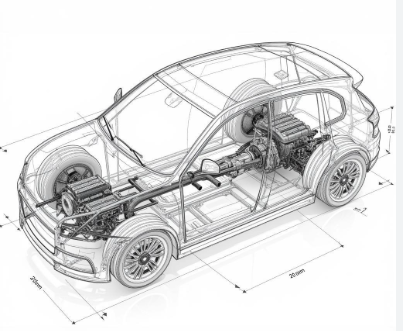
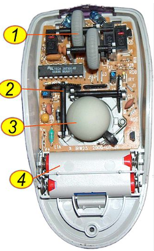
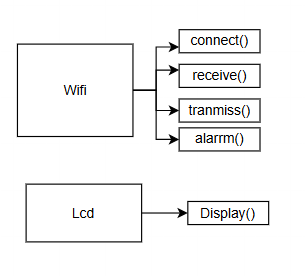
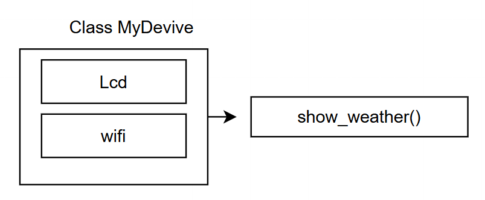
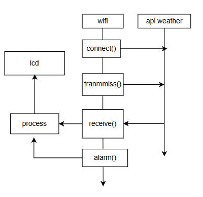

<section>
  <!-- HEADER -->
  <div class="title-header">
    
  </div>

  <!-- CENTER -->
  <div class="title-center">
    <h1>Lập trình hướng đối tượng</h1>
    <h3>Giảng viên: Ths.Lâm Du Đạt</h3>
    <p>Email: datld@donga.edu.vn</p>
  </div>

  <!-- FOOTER -->
  <div class="title-footer">
    <p>Trường Đại học Đông Á : Khoa Điện – Điện tử</p>
  </div>
  
</section>

---

# TIết 1: OPP - Tính đóng gói
<div class="content">

## Mục tiêu

- Kiến thức: Hiểu các khái niệm Lớp, Đối tượng, Thuộc tính, Phương thức và ý nghĩa Tính Đóng Gói.
- Kỹ năng: Phân tích Class đơn giản, viết Class nhỏ, tạo đối tượng và sử dụng thuộc tính, phương thức.
- Tư duy: Hình thành tư duy lập trình có cấu trúc.

</div>

---

## Đặt vấn đề

<div class="content split-2">

<div>

```python
{
  "main": {
    "temp": 300.15,
    "feels_like": 302.45,
    "pressure": 1010,
    "humidity": 75
  }
}
```

</div>

<div>

- Đọc nhiệt độ và độ ẩm ?
- Cách viết này có nhược điểm gì
- <mark>Làm thế nào để gọn gàng hơn?</mark>

</div>

</div>

---

<div>

## Khái niệm lập trình OPP
### Class , Object

<div class="content split-2">

<div class="fragment">

**Class (Lớp)**: Xem như bản thiết kế chiếc xe


</div>

<div class="fragment">

**Object (Đối tượng hay thể hiện)**:  Thể hiện của lớp: xe đua , xe bán tải...


</div>

</div>

---

### Atrribute , Method

<div class="content split-2">

<div class="fragment">

**Attribute (Thuộc tính)**: 
Đặc điểm của xe
- Giá tiền
- Màu săc
- Động cơ

</div>

<div class="fragment">

**Method (Phương thức)**:
Phương thức tác động lên chiếc xe
- Tăng tốc (đạp ga)
- Giảm tốc (Thắng xe)
- Phát ra còi
- Điều hướng (thẳng, trái,phải ...)

</div>

</div>

---

## Tính đóng gói trong OPP
Gom tất cả những thứ liên quan (thuộc tính và phương thức) vào chung một "cái hộp" là Class

<div class="content split-2">

<div>



</div>

<div>

- **class Mouse**  
- **Thuộc tính**   
  - Nút chuột trái  <!-- .element: class="fragment" -->
  - Nút chuột phải  <!-- .element: class="fragment" -->
- **Phương thức**   
  - Nhấn chuột trái <!-- .element: class="fragment" -->
  - Di chuyển chuột <!-- .element: class="fragment" -->

</div>

</div>

---

## Minh họa cách khởi tạo class

<div class="content">

```python
def __init__(self, open_weather_data): 
  main_data = open_weather_data.get('main', {})
  temp_k = main_data.get('temp','N/A')
  self.temperature_c = self.k_to_c(temp_k)
```
<!-- .element: class="fragment" -->

```python
def k_to_c(self,temp_k):
  if isinstance(temp_k, (int, float)):
    return round(temp_k - 273.15, 1)
  return 'N/A'
```
<!-- .element: class="fragment" -->

```python
def __str__(self):
  output += f"Nhiệt độ: {self.temperature_c}°C\n"
  return output
```
<!-- .element: class="fragment" -->

</div>

---

## Một vài phương thức mặc định của lớp
<div class="content">

- Phương thức ```__init___``` là hàm đặc biệt để khởi tạo lớp. Sẽ được gọi khi tạo thể hiện của lớp
- Phương thức ```__repr__()```: Phương thức này sẽ được gọi khi dùng hàm `print(...)` lên đối đối tượng
- Phương thức ```__str__()```:  Phương thức này sẽ được gọi khi dùng hảm `str(...)` lên đối tượng
- Ngoài ra còn nhiều phwuong thức đặc biệt khác: 
[A Guide to Python’s Magic Methods](https://rszalski.github.io/magicmethods/)

</div>

---

## Live code
<div class ="content">

- Bước 1: Tạo dữ liệu giả lập thời tiết
```python
sample_data = {"main": {"temp": 298.15, "humidity": 80}}
```
<!-- .element: class="fragment" -->

- Bước 2: Tạo đối tượng thời tiết
```python
weather_bmt = My_Weather(sample_data)
```
<!-- .element: class="fragment" -->

- Bước 3: Gọi phương thưc lấy thông tin
```python
print(f"Nhiệt độ: {weather_bmt.temperature_c}°C") 
```
<!-- .element: class="fragment" -->

</div>

---

## Bài tập thực hành
<div class="content">

Nhiệm vụ : **Tạo một Class tên là Sensor để mô tả một cảm biến**
- **Tên Class**: <mark>Sensor</mark>.
-	**Khởi tạo với 3 tham số đầu vào**: <mark>name, value, unit.</mark>
- **Các thuộc tính**: <mark> self.name, self.value, self.unit. </mark>
- **Phương thức**: <mark>display()</mark>: In ra thông tin cảm biến theo định dạng, ví dụ: "Cảm biến Nhiệt độ: 35.5 °C".

</div>

---

# TIết 2: OPP - Tính kế thừa
## Mục tiêu
<div class="content">

- Kiến thức: 
  - Hiểu Kế thừa, Lớp Cha, Lớp Con. 
  - Hiểu Overriding và cách dùng super().
- Kỹ năng: 
  - Đọc hiểu và phân tích được cấu trúc kế thừa trong code dự án. 
- Tư duy: 
  - Hình thành tư duy tái sử dụng, tránh lặp lại code 

</div>

---

## Tình huống 1

<div class=" content split-3">

<div>
<p class="s2">Wifi and LCD</p>



</div>

<div>
<p class="s2">MyDevice</p>



</div>

<div>
<p class="s2">Thiết kế</p>



</div>
</div>
<mark>Làm sao ta có thể tái sử dụng module dựng sẵn?</mark>

---

## Tình huống 2:
<div class="content">

Giả sử chúng ta viết đơn lẻ như sau

```python
class FanData:
    def __init__(self, id, value, timestamp):
        self.id = id
        self.value = value
        self.timestamp = timestamp
```

```python
class PumpData:
    def __init__(self, id, value, timestamp):
        self.id = id
        self.value = value
        self.timestamp = timestamp
```
<mark>Làm sao ta có thể tránh lặp điểm chung?</mark>

</div>

---

## Khái niệm tính kế thừa
### Tính kế thừa
<div class="content">

- Là cơ chế cho phép một Lớp (gọi là <mark>Lớp Con</mark> - Child Class) **thừa hưởng** lại toàn bộ thuộc tính và phương thức từ một Lớp khác (gọi là <mark>lớp Cha</mark> - Parent Class).
- Mục đích chính : Tái sử dụng code

</div>

---

### Ghi đè phương thức (Method Overriding)
<div class="content">

- Khi Lớp Con <mark>định nghĩa</mark> lại một phương thức đã có sẵn ở Lớp Cha, hành động đó gọi là ghi đè.
- Mục đích: Giúp Lớp Con có thể tùy biến, <mark>chuyên biệt hóa hành vi</mark> của mình. 
- Ví dụ: Cùng là ```__repr__``` nhưng FanData sẽ hiển thị chữ "Fan", còn PumpData hiển thị chữ "Pump".

</div>

---

### Hàm ```supper()```
<div class="content">

- Là một hàm đặc biệt dùng để gọi đến các phương thức của Lớp Cha từ bên trong Lớp Con.
- Rất hay được dùng trong ```__init__``` của Lớp Con để <mark>"nhờ"</mark> Lớp Cha thực hiện phần khởi tạo các thuộc tính chung.
- ```__init___``` là hàm đặc biệt để khởi tạo lớp.

</div>

---

## Minh họa về kế thừa
### Khai báo lớp cha
<div class="content">

```python s1
class RelayData:
    def __init__(self, id, value,timestamp):
        self.id = id
        self.value = value
        self.timestamp = timestamp
    def __repr__(self):
        return f"RelayData id={self.id}, 
        value={self.value}, 
        timestamp={self.timestamp}"
```
<!-- .element: class="fragment" -->

</div>

---

### Khai báo lớp con
<div class="content">

```python step
class FanData(RelayData):
    def __init__(self, id, value,timestamp):
        super().__init__(id,value,timestamp)
    def __repr__(self):
        return f"FanData id={self.id}, 
        value={self.value},
        timestamp={self.timestamp}"
```
<!-- .element: class="fragment" -->

</div>

---

### Bài tập thực hành
<div class="content">

Nhiệm vụ : Xây dựng lớp PumpData với yêu cầu sau
- <mark>Tên Class</mark>: PumpData.
-	<mark>Kế thừa lớp RelayData</mark>
- <mark>Nhận vào 3 thuộc tính: id, value, timestamp
- <mark>Phương thức ```__repr__()```</mark>: override phương thức ```__repr__()``` của lớp cha với định dạng
```f"PumbData id=..., value=...,timestamp=..."```

</div>

---

# Tiết 3: OPP tính đa hình
## Đặt vấn đề
<div class="content">

- Bây giờ, hãy tưởng tượng  chúng ta có một danh sách tất cả các thiết bị : Bơm , Quạt  kế thừa từ lớp Relay
- Chúng ta muốn viết <mark>MỘT chức năng duy nhất</mark> để in trạng thái của từng thiết bị. 
- Chẳng lẽ chúng ta phải viết code kiểm tra: if thiết bị là Quạt thì làm thế này, if thiết bị là Bơm thì làm thế kia? 
- <mark>Để giải quyết ta dùng khái niệm tính đa hình </mark>

</div>

---

## Khái niệm tính đa hình (Polymorphism)
<div class="content">

- "Poly" nghĩa là "nhiều", "Morph" là "hình thái". Đa hình là khả năng một hàm hoặc một đối tượng có thể xử lý nhiều kiểu đối tượng khác nhau như thể chúng là một.
- Nguyên tắc cốt lõi: <mark>"Chỉ cần 'nói chuyện' với Lớp Cha, có thể điều khiển được tất cả các Lớp Con."</mark>

</div>

---

## Minh họa tính đa hình
<div class="content">

```python
# Giả sử đã có các class RelayData, FanData, PumpData
fan1 = FanData(1, 'ON', '2025-10-23 19:00:00')
pump1 = PumpData(2, 'OFF', '2025-10-23 19:05:00')
```

```python
# Xây dựng hàm báo cáo trạng thái thiết bị
def display_status(device:RelayData):
    print("--- Báo cáo trạng thái thiết bị ---")
    print(device)
```

```python
# Quan sát kết quả khi gọi hàm
display_status(fan1)
display_status(pump1)
```

</div>

---

## Bài tập thực hành
<div class ="content">

Nhiệm vụ: Viết chương trình thực hiện các yêu cầu sau
- Tạo thêm <mark>class HeaterData</mark> kế thừa từ **RelayData**.
- Thêm thuộc tính <mark>temperature</mark> (nhiệt độ hiện tại của thiết bị).
- <mark>Ghi đè phương thức</mark> ```__repr__()``` để hiển thị: "Heater {id}, trạng thái: {status}, nhiệt độ: {temperature}".
- Gọi hàm `display_status()` ở trên để kiểm tra

</div>

---

# Thank You


